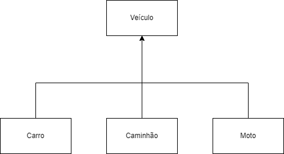
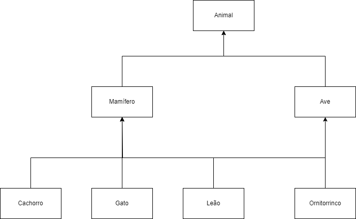
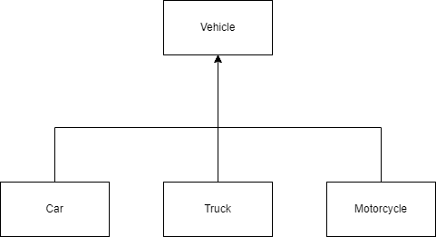

# Arendendo o Conceito de Herança com Python
Curso "Orientação a Objetos e Boas Práticas em Python", Bootcamp "Python AI Backend Developer".

## Objetivo
Criar classes com herança simples e múltipla.

## Desafio 1
Criar as classes de veículos "Caminhão", "Carro" e "Moto", que herdam as características da classe "Veículo".

## Desafio 2
- Criar as classes de "Gato", "Cachorro", "Leão", que herdam as características de "Mamíferos".
- Criar a classe "Ornitorrinco", que herda as características de "Mamífero" e "Ave". Essas duas últimas herdam as características da classe "Animal".

#

# Learning the Concept of Inheritance with Python
Course "Object Orientation and Good Practices in Python", Bootcamp "Python AI Backend Developer".

## Goal
Create classes with single and multiple inheritance.

## Challenge 1
Create the vehicle classes "Truck", "Car" and "Motorcycle", which inherit the characteristics of the "Vehicle" class.

## Challenge 2
- Create the classes "Cat", "Dog", "Lion", which inherit the characteristics of "Mammals".
- Create the "Platypus" class, which inherits the characteristics of "Mammal" and "Bird". These last two inherit the characteristics of the "Animal" class.

